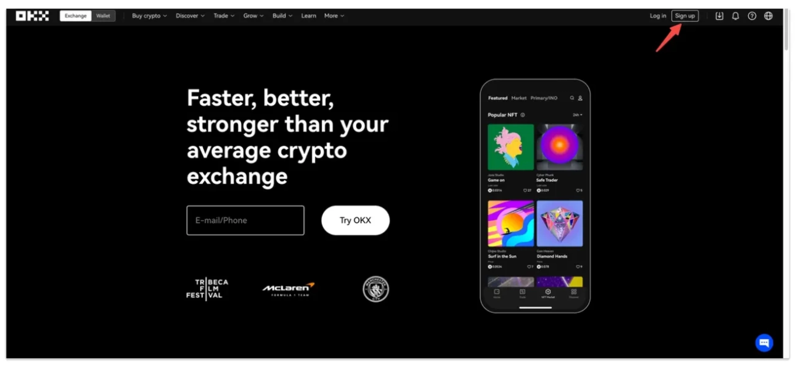
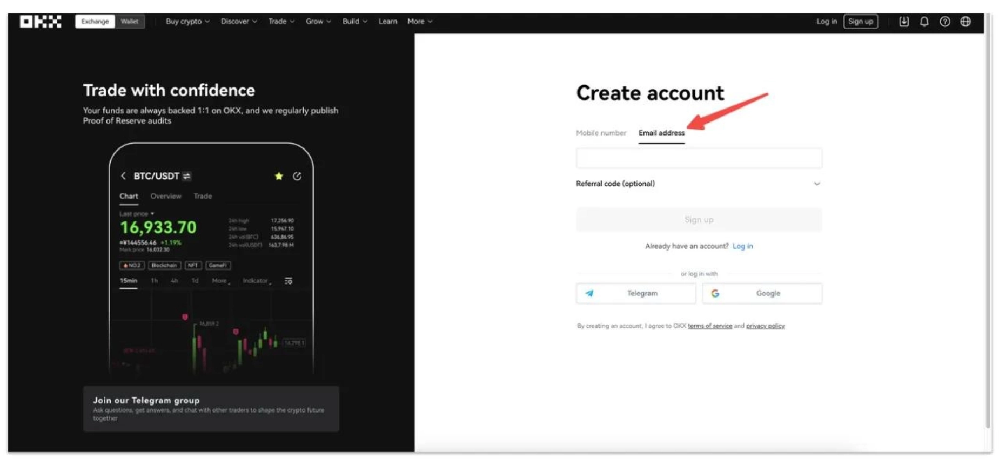
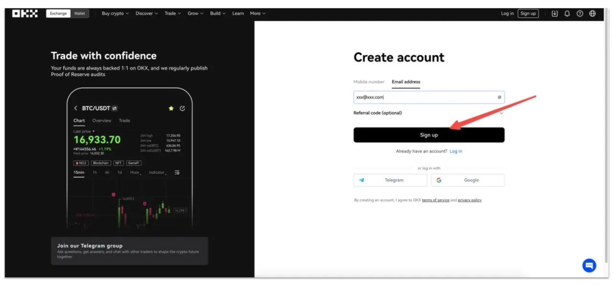
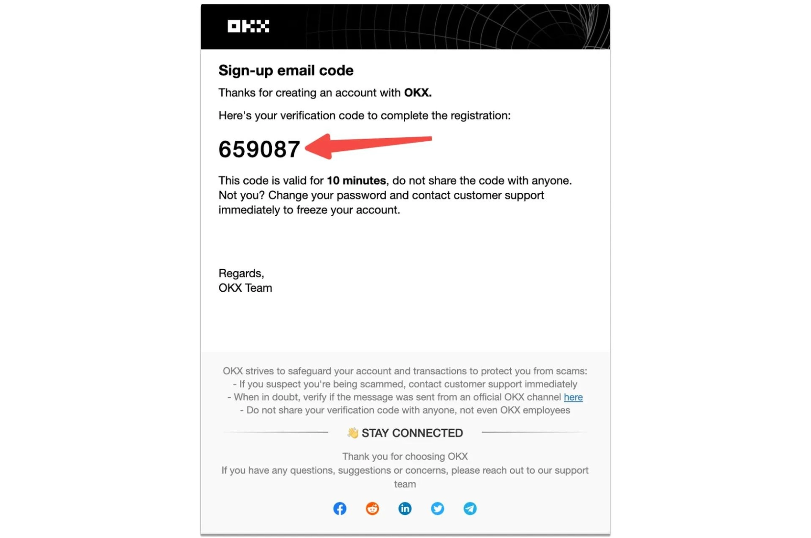
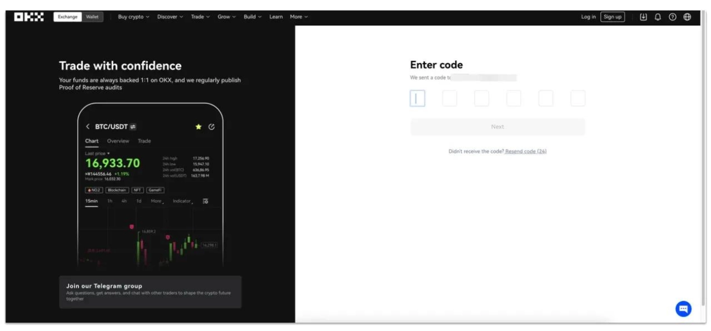
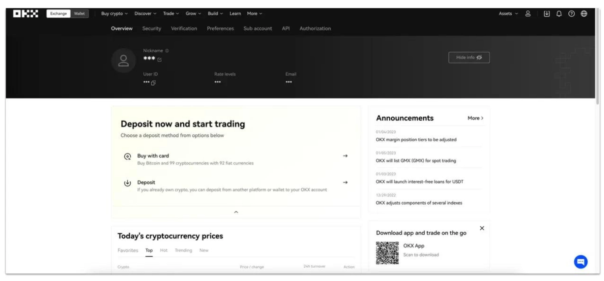
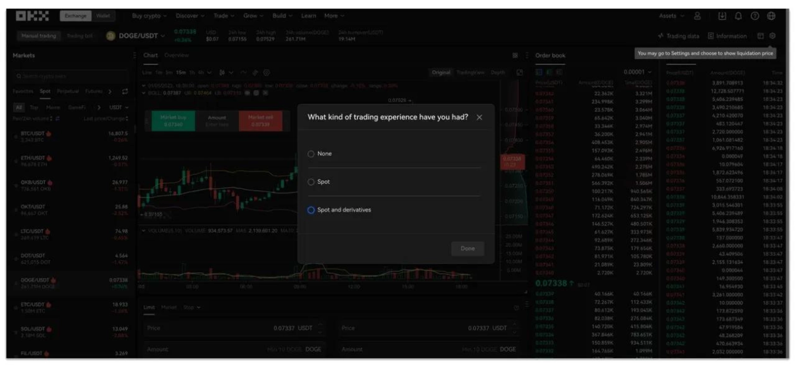
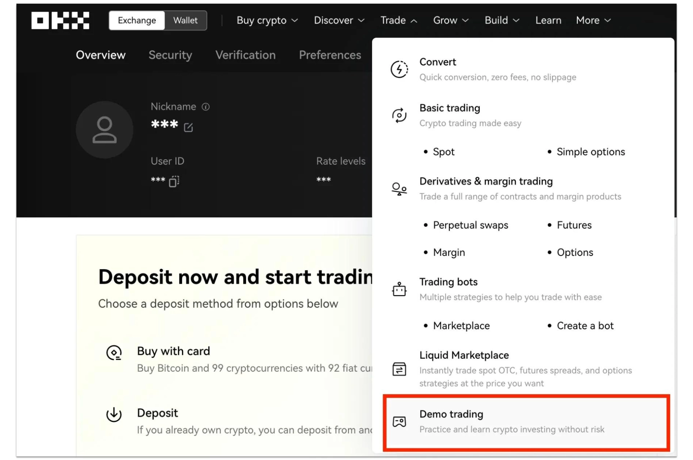

# OKX交易所评测：值得关注的数字货币投资平台

---

在数字货币投资领域，找到一个靠谱的交易平台就像找对象——得看颜值（界面），得看内涵（功能），还得看靠不靠谱（安全性）。今天咱们聊的这个OKX，就是那种"三观正、实力强"的选手。它前身叫OKEx，现在改名OKX，覆盖100多个国家，交易量大得吓人，安全措施也做得挺到位。不管你是刚入门的小白，还是玩了好几年的老手，这个平台都能给你找到合适的玩法。

---

## OKX到底是个啥？

简单说，👉 [OKX就是个超级大的数字货币交易所](https://www.okx.com/join/62834398)，你可以在这里买卖各种加密货币。它属于中心化交易所（CEX），提供现货交易、合约交易、杠杆交易这些基本操作。

有意思的是，OKX不只是个交易平台。它还自带钱包功能，你的资产你自己掌控私钥。从几百个交易对到杠杆交易、永续合约，该有的都有。新手老手都能在这里找到自己的节奏。

更酷的是，OKX不止让你买买卖卖。你还可以质押代币赚收益，参与流动性挖矿，甚至玩DeFi里那些借贷操作。想深入体验整个加密货币生态？这个平台给你提供了足够的可能性。

## 咱们实话实说：OKX的优缺点

任何平台都有长板和短板，OKX也不例外。咱们先看看它哪里做得好，哪里还差点意思。

### 让人满意的地方

**安全和信誉**  
OKX不是那种野鸡平台。它在行业里摸爬滚打这么多年，在一些国家还拿到了合规牌照。安全措施做得挺扎实：双重验证（2FA）、冷钱包储存、保险机制，该有的都有。

**交易量大到吓人**  
OKX的比特币现货交易量全球第一。这意味着啥？流动性好，你想买就能买到，想卖就能卖出去，不用担心卡单。

**手续费比较良心**  
跟其他平台比，OKX的交易手续费算是比较低的。省下的手续费积少成多，长期下来也是一笔不小的钱。

**产品线很丰富**  
现货、杠杆、合约、期权、质押……你能想到的玩法基本都有。想分散投资？想尝试不同策略？这里给你提供了足够的选择空间。

**币种超级多**  
支持600多种加密货币。从主流币到小众山寨币，选择多到让人眼花。

**界面不难用**  
UI设计得挺清爽，功能布局也合理。新手不会觉得太复杂，老手也不会觉得功能不够用。

**客服24小时在线**  
遇到问题随时能找人，👉 [而且支持多种语言，沟通起来方便](https://www.okx.com/join/62834398)。

### 需要注意的地方

**地域限制**  
美国和中国大陆用户没法直接用。如果你在这些地方，得想其他办法。

**假网站多**  
OKX名气大，仿冒网站也多。一定要认准官方网址，别被钓鱼网站骗了。官方地址记住了：okx.com

**投资有风险**  
这是废话，但还是得说。加密货币价格波动大，赚钱的同时也可能亏钱。别拿生活费来玩，别借钱炒币。

## 新手必看：怎么注册OKX账户

注册过程其实挺快的，几分钟就搞定。跟着这个步骤走就行。

**第1步：打开官网注册页面**  
去OKX主页右上角，点"注册"按钮。

**第2步：填邮箱**  
输入你的邮箱地址。最好用常用的，方便接收验证码。

**第3步：点注册**  
确认邮箱无误后，点"注册"按钮继续。

**第4步：查收验证码**  
打开你的邮箱，会收到一个6位数的验证码。

**第5步：输入验证码**  
你有10分钟时间输入验证码。输完点"下一步"。

**第6步：设置密码**  
这一步很关键。密码要设得复杂点：

- 大小写字母、数字、符号都用上
- 别用生日、手机号这种容易被猜到的
- 千万别告诉任何人，包括自称OKX客服的人

**第7步：开始使用**  
注册完就能进入控制面板了。这时候你有两个选择：

- 直接用信用卡买币：支持92种法币购买100种加密货币
- 充币进来：如果你在别的地方已经有币了，可以转到OKX

**第8步：选择交易模式**  
鼠标移到顶部"交易"菜单，选你想玩的类型。第一次会让你填个问卷，了解你的交易经验。

**第9步：先用模拟盘练手**  
不管你是新手还是想试试新策略，都建议先用模拟账户练练。用虚拟资金操作，不用担心亏钱。在"交易"菜单里选"模拟交易"就能进入。

---

## 写在最后

OKX作为一个老牌交易所，在安全性、交易量和功能丰富度方面确实做得不错。如果你在找一个覆盖全球、流动性强、产品线完整的交易平台，OKX值得考虑。当然，投资加密货币本身就是高风险的事，赚钱的同时也可能亏钱。

入场之前先做功课，了解清楚自己在做什么。别听风就是雨，别看到别人赚钱就冲动。这个市场没有稳赚不赔的神话，只有理性投资和风险控制。想开始你的数字货币之旅？👉 [现在注册OKX，使用邀请码62834398](https://www.okx.com/join/62834398)，开启你的投资体验。记住：投资需谨慎，别拿输不起的钱来玩。
